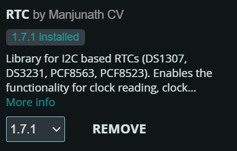

# Project Cronus

#### Simple and Organised Arduino library for I2C based RTCs.

This library enables the functionality for clock reading, clock setting, alarms and timers of I2C RTCs.

| Features  | DS1037 | DS3231 | PCF8563 | PCF8523 | MCP7940 |
|:---------:|:------:|:------:|:-------:|:-------:|:-------:|
| Address   |  0x68  |  0x68  |   0x51  |   0x68  |  0x6F   |
| 12 hours  |  Yes   |  Yes   |   No    |   Yes   |   Yes   |
| Centuries |  0     |  1     |   1     |   1     |    1    |
| Alarms    |  0     |  2     |   2     |   1     |    2    |
| Timers    |  0     |  0     |   1     |   2     |    0    |

# How to Install

Search RTC from Arduino Library

# To Do

* Fix Unix Time Issue
* Fix Weeks for all RTCs
* Implement Alarms & Timers for Supported RTCs

# Future
* DS1337
* RV-8803-C7
* SD3031

## Reference & Documentation
* [RTC Wiki](../../wiki).

